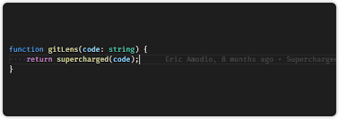
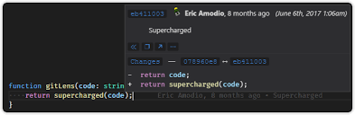
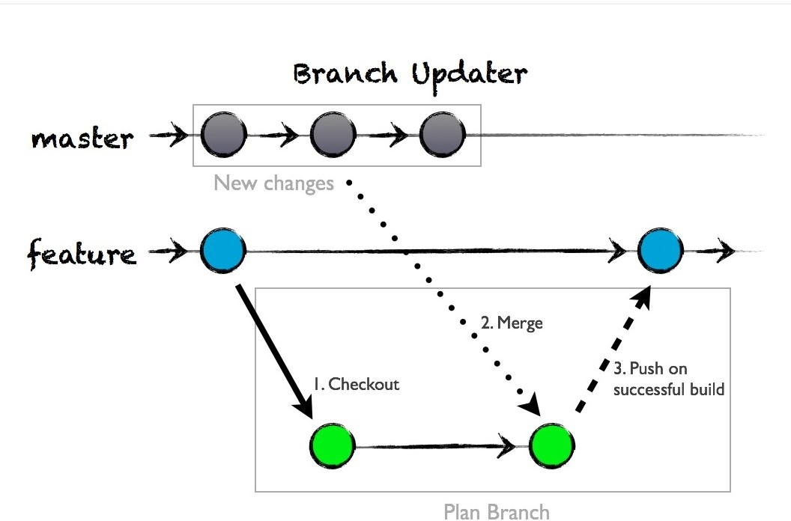
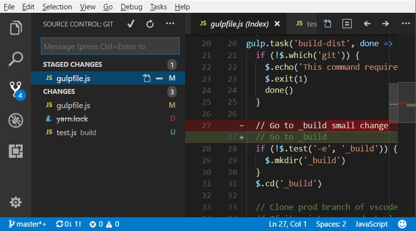
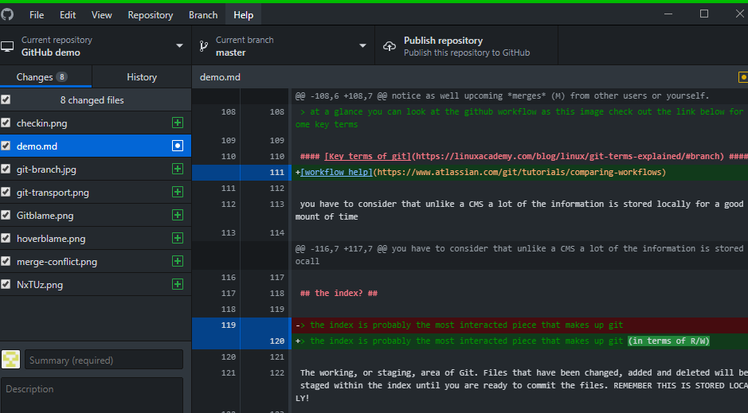

###### version will be applied by git ######

this is a test
=============

>all of the items here are part of a test or demo

this is an example of how to use git, visual studio and markdown. An all in one development solution covering versioning, compiling, 

## an example of how to use git and Markdown files for documentation ##

>documentation can be dead set simple. no need for fancy word documents
this 

you can also have plain text for lenthly content.

``` Markdown 
text headers are preceded by ">" with no space 
```

* code set 1
    * sub code set 1.1
* code set 2
    * sub item 1
    * sub item 2
    * sub item 3

>written as

``` Markdown
 * item  --  ensure the space!
    * subitem
 
 ``` 


## this could be example code or SQL ##

``` SQL
select egg.*, b.tail 
from eggtable egg 
left join beaver on beaver.id = egg.id
where egg.chickens != table.column 
```

# We often talk about the importance of versioning #

>versioning our scripts and branching them will reduce our level of work
and allow us to recycle code.

this is a pretty critical timesaving feature. there are many GUI's built into VScode alone and of course Github desktop as a standalone

>the "blame" feature allows you to see who made changes




if you hover over a section of code, github users of the same repository will leave a trail of changes - hovering for a few seconds brings up the info panel below

ie. rootUser made a 'commit' a 21 days ago.



> an example of using branching for each user/site

| Joel            | Cam           | Tom       |
|:-------------:  |:-------------:|:---------:|
| egg.SQL  1.0    | egg.SQL 1.2   |egg.SQL 1.2|
| Initial (master)| Branch        | branch    | 

below we can see what this looks like

 


so now we can stop writing every time

``` SQL
select * from kuaf k
left join dtree dt on dt.userid = k.id
where dt.egg = (select * from barnyards etc)
```

```ABAP
* hello abap!

 WRITE: 'hello' , 'world'

 DATA text_line TYPE C LENGTH 40.
    text_line = 'this data type is a string' 

*using character array method but i prefer

DATA text_line TYPE STRING.
    text_line = 'this data type is a string' 
```

>the check in feature

notice as well upcoming *modifications to index* (M) from other users or yourself. 




# The github workflow #

> at a glance you can look at the github workflow as this image check out the link below for some key terms

#### [Key terms of git](https://linuxacademy.com/blog/linux/git-terms-explained/#branch) ####
[workflow help](https://www.atlassian.com/git/tutorials/comparing-workflows)

you have to consider that unlike a CMS a lot of the information is stored locally for a good amount of time


## the index? ##

> the index is probably the most interacted piece that makes up git (in terms of R/W)

The working, or staging, area of Git. Files that have been changed, added and deleted will be staged within the index until you are ready to commit the files. REMEMBER THIS IS STORED LOCALLY!

if you are a frequent scripter, it is useful to use the index as a way of checkpointing your work. if you change description in your script its easier than saving ;

>*backup.sql* 
*backup2.sql* 
*backup2new.sql*

instead you can review line by line changes by visually inspecting the index or you can do a ` git show-index` command for a terminal output 

> Demonstration below of git changes

now some changes ----- *here* -----


